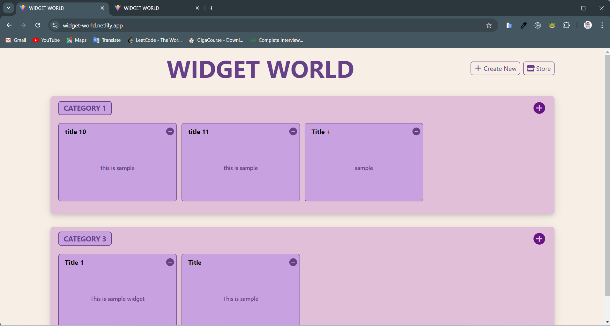
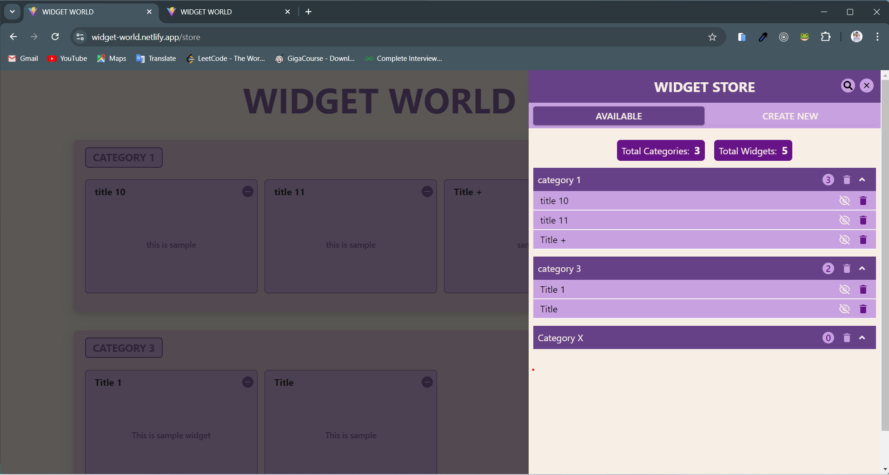
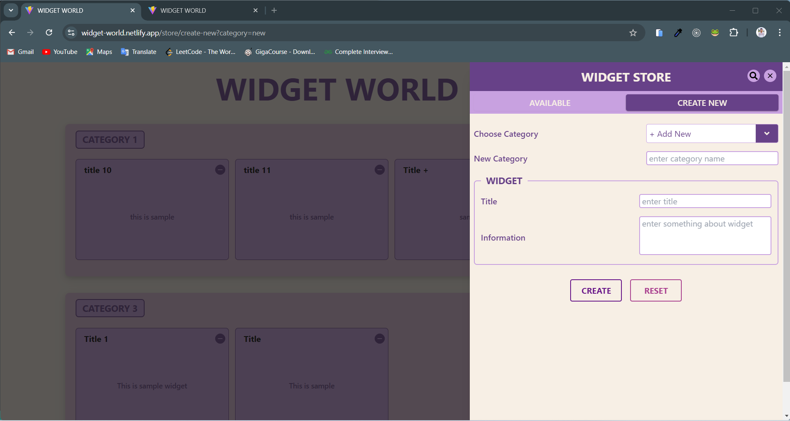
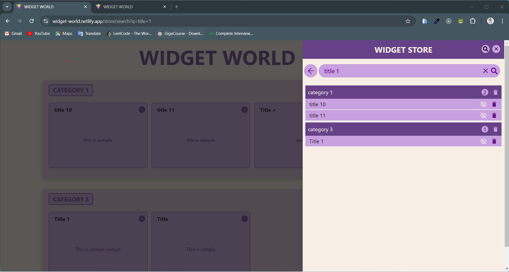

# Widget World

## Table of Contents

1. [Introduction](#introduction)
2. [Key Features](#key-features)
3. [Key Techniques](#key-techniques)
4. [Technologies Used](#technologies-used)
5. [Project Structure](#project-structure)
6. [Installation and Setup](#installation-and-setup)
7. [Conclusion](#conclusion)

## Introduction

The Widget World is a React-based application built using Vite. Built with **React** and **TypeScript**,the application leverages modern web development practices to provide responsive and user-friendly interface.
It allows users to create and manage widgets, although the widgets themselves are informational and do not contain functional logic. The main focus of the project is on the structure, design, and implementation of the context-based state management system within the application.

### Deployment

This project has been successfully deployed on **Netlify** making it easily accessible online. You can view th live version of the project by visiting the following link: [Netlify Deployment Link🔗](https://widget-world.netlify.app/)

**Main Page**


**Widget Store**


**Add New**


**Search**


## Key Features

- **Widget Management**: Users can **add new widgets+** with titles and descriptions, **hide/unhide** widget, **delete** category and Widget.
- **Category Management**: Widgets can be organized into categories, with the option to create new categories.
- **Search**: User can search for widget with specific name in Widget Store.
- **Form Validation**: Custom validation logic ensures that all required fields are completed and that no duplicate widget titles exist within a category.
- **Responsive Design**: The app is fully responsive, ensuring a consistent user experience across different devices.
- **Custom Dropdown**: The app includes a custom dropdown component for selecting widget categories.

## Key Techniques

1. **Context-Based State Management**:

- The application utilizes the WidgetAppContext to manage the global state, particularly the list of widgets.
- It provides functions like handleAddNewWidget to add new widgets to the list.

2. **Responsive Design**:

- The UI components are designed to be responsive and adapt to different screen sizes.
- The dropdown menu, form fields, and buttons adjust accordingly based on the screen size.

3. **Form Handling and Validation**:

- The app includes a form for adding new widgets with fields for the title and information.
- Validation is implemented to ensure that required fields are filled before submission.

4. **Dynamic Routing with react-router-dom**:

- The app uses dynamic routing to handle different URL parameters, enabling users to add new categories and widgets.
- The useSearchParams hook is utilized to manage query parameters within the application.

5. **Modular and Reusable Components**:

- The app is structured with modular components like AddNew, ValidationError, and others, making the codebase easier to maintain and extend.

## Technologies Used

- **React**: For building the user interface and managing component state
- **TypeScript**: For type-checking and ensuring code qualityReact
- **Vite**: A build tool that provides a fast and optimized development environment
- **Context API**: For state management across the application
- **React Router**: For routing and managing URL parameters
- **CSS Modules**: For styling components with locally scoped CSS
- **Vitest**: For unit testing, integration testing.

## Project Structure

The project is organized into the following main directories:

- **components/**: Contains reusable UI components like AddNew, ValidationError, etc.
- **container/**:Houses the main container component that manages the overall application layout.
- **features/**:Includes specific features of the application such as the widget store and search functionality.
- **context/**: Implements React context for state management across the application.
- **hook/**:Custom hooks used throughout the application.
- **router/**:Defines the application's routing structure.
- **types/**: Defines TypeScript types used across the application.
- **utils/**: Includes utility functions like addNewWidgetFormValidation.
- **tests**: Every Component contains separate **test** folder which include test specific to that component.

## Installation Steps

**Running the project locally with vite**

### Perquisites

Ensures you have
[Node.js](https://nodejs.org/) and [Git](https://git-scm.com/) installed on your machine. You will also need either [npm](https://www.npmjs.com/) or [yarn](https://yarnpkg.com/)

## Installation and Setup

**1.Clone the Repository**

Open your terminal and navigate to the directory where you want to clone the project:

```bash
git clone https://github.com/probhask/widget-world.git
```

**2. Install Dependencies**

```bash
npm install
or
yarn install
```

**3. Run the Development Server**

```bash
npm run dev
or
yarn dev
```

This development server will start, and you should see output indicating the server is running.

**4. Open the Application**

Open your browser and navigate to the local URL provided by Vite development server to view React Application

**5. Run Test**

```bash
npm run test
or
yarn test
```

## Conclusion

This Widget App project showcases the use of React, Vite, and modern web development practices like context-based state management, modular component design, and thorough testing. The project serves as a solid foundation for more complex applications and demonstrates best practices in frontend development.
